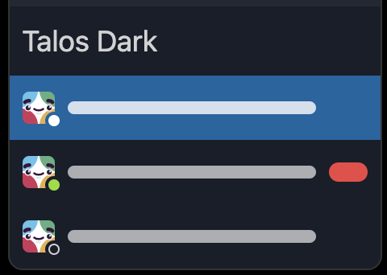

<p align="center">

</p>

# Talos Dark Slack Theme

### How to Install Manually

- Copy the values below.

```
#191E2A,#121016,#1164A3,#FFFFFF,#232834,#D1D2D3,#8FE01D,#EF4444,#232834,#D1D2D3
```

- In Slack, paste the values in any Channel or Conversation - such as Slackbot
- Click on the "Switch sidebar theme" button to install the theme
